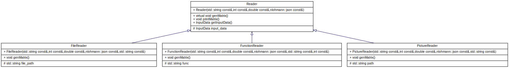
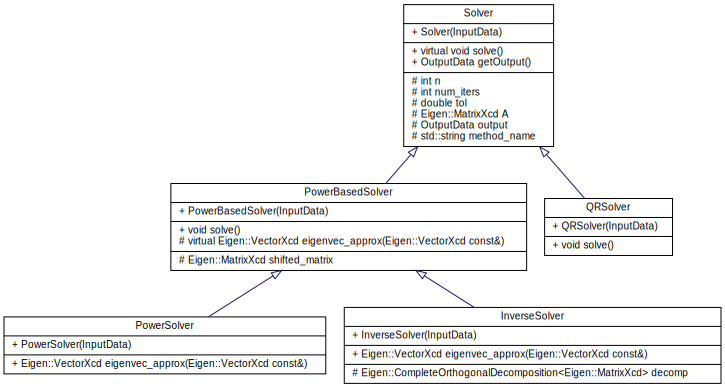
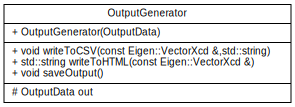
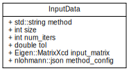
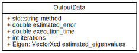

# Project 1: Eigenvalue Problems
 This document provides useful information for interacting with our eigenvalue solver code. We provide documentation for compiling, interacting, and the usage of our code.

## Table of Contents
1. [Compilation](#compilation)
2. [Program Usage](#program-usage)
    - [Program Execution](#program-execution)
    - [Configuration File](#configuration-file)
3. [Features](#features)
    - [Power Method](#power-method)
    - [Inverse Power Method](#inverse-power-method)
    - [QR Method](#qr-method)
    - [Error Handling](#error-handling)
4. [Testing](#testing)
    - [Reader Tests](#reader-tests)
    - [Solver Tests](#solver-tests)
5. [Code Layout](#code-layout)
6. [Future Work](#future-work)

## Compilation
Compilation of the code is done through CMake. In our repository we have two submodules:
 - eigen
 - googletest

In order to compile the code, you should first populate the submodules. The make file does this automatically but you can explicitly do it with this command.

```
git submodule update --init
```

Then, building is done as usual, e.g. with CLion or in the terminal:

```
mkdir build
cd build
cmake ..
make
```

The CMake links the source code to a file `main.cc`. The compilation will make an executable file called `main`. 

## Program Usage
In this section we will explore the general flow of the program's execution and how to work with the configuration file.

### Program Execution 
To interact with the code, you must work with the configuration file `config.json`. By default this file is located in the root of the repository. Our code will access the configuration file in that directory by default. Instead, users can pass a custom path to the file when executing the code.

```
./main relative_path_to_config
```

The configuration file allows a user to interact with the program by assigning values to a default JSON structure. Common parameters across different eigenvalue solvers, like the number of iterations and tolerance, will be default keys at the outermost level in the JSON object. Users can control the solver desired and the type of input provided in this configuration file. 

Once users have altered the configuration file with how they want to use the code, you can compile and execute. There is no need to recompile when making alterations to the configuration file. 

### Configuration File
In this section we will give all details about the configuration file and how a user can interact with it. The file can be effectively split into three parts:
- Basic configuration used for every run
- Input type specific configuration
- Method specific configuration 

#### Basic Configuration
This is the part of the file that is used everytime a solver is run, no matter the specific methodology used. Here is a list of the parameters that the user can interact with upon use:
- "MAX_ITERS"
- "TOLERANCE"
- "INPUT"
- "METHOD"

Every solver implemented in our code is an iterative method, thus `MAX_ITERS` expects an integer value signifying the maximum number of iterations for the method. 

`TOLERANCE` expects a real number and is used to meaure convergence at each iteration. 

`INPUT` allows the user to specify how they want to provide an input matrix. Our current implementation supports three input types:
- "FILE": a CSV file containing the full matrix
- "FUNCTION": a function for how to build the matrix
- "PICTURE": an image that will be read as gray-scale

`METHOD` allows the user to specify which type of solver they want to use for finding eigenvalues. Our current implementation supports three method types:
- "POWER": finds the largest magnitude eigenvalue
- "INVERSE": finds the smallest magnitude eigenvalue
- "QR": finds all eigenvalues

`POWER` and `INVERSE` methods allow support for applying shifts to the input matrix. This allows you to find different eigenvalues than the default methods seek out.

Based on the values given under the `INPUT` and `METHOD` keys, there are specific nested objects for each option. The code works by accessing the nested objects corresponding to the user-provided `INPUT` and `METHOD` values. Inside these nested objects are specific parameters for the type. 

#### Input Type Configuration
Each `INPUT` type has a specific configuration. 

`FILE`: 
- "PATH": string containing a path to the input matrix file

`FUNCTION`:
- "FUNC": string containing an expression with row *i* and column *j*
- "SIZE": integer specifying how large of a matrix to create

`PICTURE`:
- "PATH": string containing a path to the input image

#### Method Specific Configuration
`METHOD` types can have a specific configuration as well.

`POWER`:
- "SHIFT": a complex number in the format "5 + 3i" specifying the shift to apply to the input matrix

`INVERSE`:
- "SHIFT": a complex number in the format "5 + 3i" specifying the shift to apply to the input matrix

The QR method does not have any specific configuration. Future developers can easily add the configuration for a new method using a unique nested object.

#### Example Configuration 
Below is an example configuration only showing the relevant entries. The configuration file provided in the repository contains all possible entries.

```json
{
    "MAX_ITERS": 500,
    "TOLERANCE": 1e-6,
    "INPUT": "FILE",
    "METHOD": "POWER",

    "FILE": {
        "PATH": "path_to_matrix.csv"
    },

    "POWER": {
        "SHIFT": 5
    }
}
```

## Features
In this section will go through the features of our code and what it can be used for. As mentioned before, the user has control of the input provided and the method they want to use.

Our code provides the functionality to find eigenvalues of complex or real matrices. The matrices can be provided via:
- CSV files
- An expression in *i* and *j*
- Gray-scale images

The CSV files would take the following form for a 2x2 matrix:
```
1+2i, 1
4, 4-5i
```

Our code has support for three different iterative methods for finding eigenvalues:
- Power method with an optional shift
- Inverse power method with an optional shift
- QR method

### Power Method
The power method by default finds the largest in magnitude eigenvalue of a matrix. By providing a shift $\mu$, you can alter the input matrix ($A-\mu I$). This has the effect of providing the same shift to the eigenvalues of $A$, $\lambda_i - \mu$ for $\lambda_1$ to $\lambda_n$. Our power method code returns the eigenvalue of $A$ corresponding to the largest eigenvalue in the shifted matrix. By utilizing different shifts, you can find different eigenvalues of $A$ than the largest in magnitude.

### Inverse Power Method
The inverse power method by default finds the smallest in magnitude eigenvalue of a matrix. By providing a shift $\mu$, you can alter the input matrix ($A-\mu I$). The inverse power method solver with a shift will find the eigenvalue closest to the shift provided. This method is especially useful if you have an estimate for an eigenvalue beforehand.

### QR Method
The QR method only has one functionality: to find all the eigenvalues of a matrix. 

### Error Handling
Our code has custom error handling to make intuitive and adaptable error messaging. We created a parent Error class that handles a message and two daughter classes, ConfigError and ReaderError. 

## Testing
In our test suite contained in the `test` folder we focus on testing two parts of the code:
- Reader classes
- Solver classes

### Reader Tests
In the file `ReaderTests.cc` we provide a variety of tests to check whether the Reader classes generate the correct input matrix for different input types and throw exceptions when expected. Each test takes a configuration file located in the directory `ReaderTests` and creates the relevant Reader class. For problematic configurations, we test that the code throws the appropriate exception. Users wanting to add additional tests can add the configuration they want to test in the `ReaderTests` folder along with necessary files needed for the configuration. 

### Solver Tests
Testing for the solvers is done in the file `SolverTests.cc`. The solver tests are meant for developers to use to confirm their eigenvalue solver implementation is calculating the correct eigenvalues. For developers, you can easily add additional tests by including additional matrices in the member variables of the `Matrices` class and adding the test configuration in the INSTANTIATE_TEST_SUITE_P class. The eigenvalues calculated from our solvers are compared with ComplexEigenSolver in the Eigen library. 

There are two solver suites: one for PowerBasedSolvers and one for the QR method. We use GoogleTest's templated TestWithParam class for both suites. In the PowerBasedSolver test suite our parameter is a tuple containing the matrix to test on and the complex shift to apply. In the QR method test suite our parameter is only the matrix to test on. Each suite tests whether the eigenvalues our solvers calculate and the built-in solver calculates are within a certain precision of one another.  

For both suites we use 2000 iterations and a tolerance for convergence of 1e-6 for the solvers.
 
## Code Layout
This code can be mainly split in three parts:
- Reader classes
- Solver classes
- OutputGenerator class

### Reader Structure


### Solver Structure


### OutputGenerator Structure


### Data Structures




## Future Work

- In the future we need to add support for more input options. As of now, text files are limited to CSV. We would like to add support for different delimeters.
- The power and inverse methods only find a singular eigenvalue. We implement a method to get all eigenvalues with these methods.  
- Implement other types of solvers.
- Add support for plotting convergence.